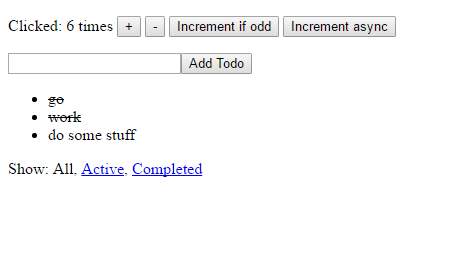

## What is React-Redux-Reuse
[](https://www.npmjs.com/package/react-redux-reuse)
[](https://www.npmjs.com/package/react-redux-reuse)
[](https://raw.githubusercontent.com/somewind/react-redux-reuse/master/LICENSE)

`React-Redux-Reuse` is a component, which you can use to create reusable components for React-Redux project.


## Installation

To install the stable version:

```
npm install --save-dev react-redux-reuse
```

## How to Use?

`React-Redux-Reuse` work with:

- [React](https://github.com/facebook/react) 
- [React-Dom](https://www.npmjs.com/package/react-dom) 
- [Redux](https://github.com/reactjs/redux) 
- [React-Redux](https://github.com/reactjs/react-redux) 
- [Redux-Thunk](https://github.com/gaearon/redux-thunk) 
- [Redux-Sword](https://github.com/somewind/redux-sword) (About `Redux-Sword`, you can learn from [Here](https://github.com/somewind/redux-sword))
   

A completed example is combine `counter` and `todos` app in one. Those apps is examples from [Redux](https://github.com/reactjs/redux) , which used `React` also.

[Example](https://github.com/somewind/react-redux-reuse/tree/master/examples)


## Code from Example

Action definition

```js

export function onIncrement() {
  return options => (dispatch, getState) =>{
    //do some network stuff.
    dispatch({
      type: 'INCREMENT',
      [options.name]: {
        count: getState()[options.name].count + 1
      },
    })
  }
}

```

Reducer definition by `Redux-Sword`

```js

export default {
  count: 0,
}

```

`React-Redux` component definition

```js

import React, { Component } from 'react'
import {bindActionCreators, connect} from 'react-redux-reuse'

import Counter from './components/Counter'
import * as actions from './actions'

class App extends Component {
  render() {
    const {count, actions} = this.props
    return (
      <Counter onIncrement={actions.onIncrement} onDecrement={actions.onDecrement} value={count}/>
    )
  }
}

export default connect(actions)(App);

// Advanced Usage:

// function mapStateToProps(options, state) {
//   return {
//     ...state[options.name],
//     otherCombineState,
//   };
// }
//
// function mapActionToProps(options, dispatch, getState) {
//   return {actions: bindActionCreators(options, {...actions, otherCombineAction}, dispatch)};
// }
//
// export default connect(mapStateToProps, mapActionToProps)(App);

```

Main App Reference

```js
/**
 * Created by maoshuchen on 9/28/2016.
 */
import React from 'react'
import { render } from 'react-dom'
import { createStore, applyMiddleware, compose, combineReducers} from 'redux';
import {equipSword} from 'redux-sword'
import thunk from 'redux-thunk';
import { Provider } from 'react-redux'

import CounterAppCreator from './counter'
import counterReducers from './counter/reducers'

import TodosAppCreator from './todos'
import todosReducers from './todos/reducers'

const reducers = combineReducers(equipSword({
  counterApp: counterReducers,
  todosApp: todosReducers
}));

const store = compose(applyMiddleware(thunk), window.devToolsExtension ? window.devToolsExtension() : f => f )(createStore)(reducers);

const AppCounter = CounterAppCreator({
  name: 'counterApp'
});

const AppTodos = TodosAppCreator({
  name: 'todosApp'
});

render(
  <Provider store={store}>
    <div>
      <AppCounter />
      <AppTodos />
    </div>
  </Provider>,
  document.getElementById('root')
)


```

## License

MIT
